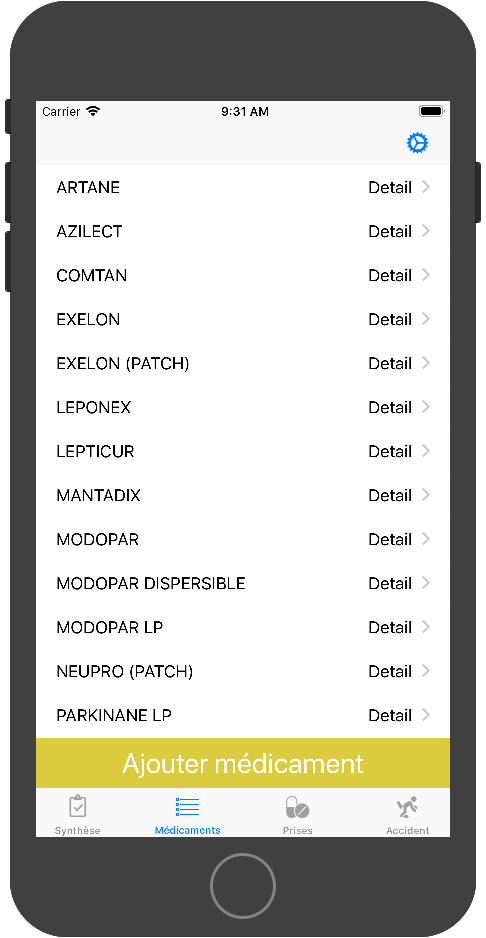

# MonPkEtMoi
> Application IOS pour faciliter le suivi médicamenteux des patients atteint de la maladie de Parkinson.  

L'application permet d'avertir le patient lors de la prise de médicaments,  d'un rendez-vous avec un praticien, la réalisation d'activité ou de noter son état actuel à intervalle régulier. Il a la possibilité de noter un accident lorsqu'il survient (chute, somnolence, ...).  
Son neurologue peut avoir accès à ses ordonnances, les accidents rencontrés les 6 derniers mois ainsi que les états 5 jours avant son rendez-vous.
Et enfin il peut gérer la liste des médicaments présents sur le téléphone du patient. 

L'application n'étant pas finalisée, elle n'est pas présente sur l'App Store. 
Pour la tester il vous faudra lancer le logiciel XCode ainsi que son simulateur sur un Mac. 

## Cas d'utilisation
### Patient
Au lancement de l'application, un compte doit être créé : 

Lorsqu'il est crée le patient est redirigé vers ce qui sera sa nouvelle page d'accueil 

Il peut ajouter un médicament de l'ordonnace  

Puis il renseigne les heures de prise associées au médicament

Il peut avoir un résumé des différentes informations de l'application 

### Docteur 
Si le compte du patient est créé alors le docteur peut accèder à son espace 

Il peut modifier, supprimer ou ajouter un médicament dans la liste disponible 

Il peut voir le nombre de prise de médicament pris en retard (avec une tolérance de 15min après l'heure de prise)  en rouge

## Explications

1. L'application n'est pour l'heure  destinée qu'aux Iphone supérieur à la version 6 (problèmes d'affichage)
2. La persistance des données est locale, elle est gérée par CoreData et Sqlite
3. Lors du premier lancement de l'application, celle-ci est pré-remplie via l'utilisation de *seeders* qui sont lancés au premier démarrage de l'application 